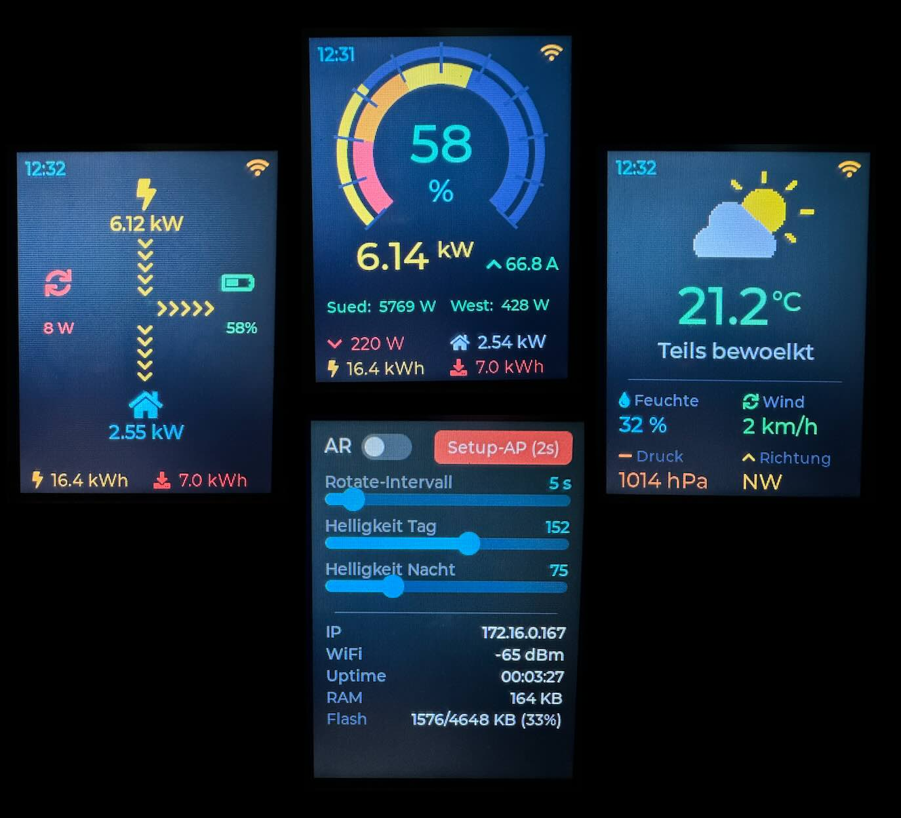

# CYD_over_Mqtt_Solar-Display (LVGL)

Ein MQTT-gestütztes Statusdisplay für Photovoltaikanlagen. Zeigt PV-Leistung,
Batteriezustand, Stromfluss, Tagesstatistiken sowie Wetterdaten
kompakt auf einem 2.8"-Touchscreen an.

Läuft auf dem **ESP32-2432S028** (bekannt als "Cheap Yellow Display" / CYD)
und ist als UI auf Basis von **LVGL 8.3** + **LovyanGFX** implementiert.

**Funktioniert mit jedem Wechselrichter**, der seine Messwerte via MQTT
bereitstellen kann — typischerweise über ein Home-Assistant-Add-on oder
ein entsprechendes Python-/Node-RED-Werkzeug. Die Namensgebung der
MQTT-Topics folgt dem Deye-/Sunsynk-Schema, passt aber genauso zu
Growatt, SMA, Solax, Fronius und allen anderen Herstellern, wenn deren
Daten auf die im Abschnitt [Benötigte MQTT-Daten](#benötigte-mqtt-daten)
beschriebenen Topic-Namen gemappt werden.

 
---

## Überblick der Funktionen

> **Hinweis zur Kompatibilität:**
> Das Display ist **wechselrichter-agnostisch**. Es kann mit **jedem**
> Wechselrichter oder jeder Datenquelle verwendet werden, solange die
> im Abschnitt [Benötigte MQTT-Daten](#benötigte-mqtt-daten) definierten
> Topics bereitgestellt werden. Die Namensgebung der Topic-Suffixe folgt
> dem Deye-/Sunsynk-Schema, ist aber beliebig konfigurierbar bzw. durch
> eine vorgeschaltete Umformung (Node-RED, Python-Skript, HA-Automation)
> anpassbar.
>
> Konkret getestet mit dem Home-Assistant-Add-on
> [**Sunsynk/Deye Inverter (multi)**](https://github.com/kellerza/sunsynk),
> das die entsprechenden MQTT-Topics direkt bereitstellt. Andere Quellen
> wie [deye-inverter-mqtt](https://github.com/kbialek/deye-inverter-mqtt),
> eigene Python-Skripte, [ESPHome](https://esphome.io/)-Instanzen,
> Growatt-, SMA-, Solax- oder Fronius-Integrationen funktionieren
> genauso, solange die Topic-Struktur passt.

- **Solar-Seite:** Großer Doppelring zeigt Batteriezustand (innen, mit
  Farbverlauf von Rot bis Grün) und Tagesfortschritt der PV-Erzeugung
  (außen, wechselt bei Erreichen des Tagesziels auf Grün). Darunter
  PV-Leistung, Netz, Hausverbrauch und Tageszähler.
- **Wetter-Seite:** Temperatur (farbcodiert), Wettersymbol, Luftfeuchte,
  Wind, Druck, Windrichtung. Quelle: Home-Assistant-Weather-Integration
  via MQTT.
- **Settings-Seite:** Auto-Rotate an/aus, Rotate-Intervall, Helligkeit
  Tag & Nacht mit Live-Vorschau, Info-Panel (IP, RSSI, Uptime, RAM, Flash).
- **Setup-Modus:** WLAN-AP mit QR-Code zur Schnellprovisionierung,
  Web-Formular zum Konfigurieren aller Einstellungen inklusive
  PV-Tagesziel und Display-Controller-Typ.
- **Automatische Helligkeit:** Sanfte Dämmerungsblende ±1h um Sonnenauf-
  und -untergang, berechnet via SunCalc aus Standort-Koordinaten.
- **Bedienung per Touch:** Wischen Links/Rechts zwischen Solar ↔ Wetter,
  nach unten zur Settings-Seite.
- **Unterstützt alle drei CYD-Varianten** (ST7789, ILI9341, ILI9342) —
  Display-Controller ist per Web-Setup auswählbar.

---

## Was zeigt das Display?

### Oben

- Uhrzeit links, WLAN-Symbol rechts (Farbe zeigt Signalstärke)

### Großer Doppelring (Hauptanzeige)

- **Innerer Ring** — Batterieladestand mit Farbverlauf von Rot (leer)
  über Orange und Gelb bis Grün (voll); aktueller Prozentwert groß
  in der Mitte
- **Äußerer Ring** — Tagesfortschritt der Photovoltaik-Erzeugung
  relativ zum gesetzten Tagesziel; gelb während des Tages, wechselt
  auf grün sobald das Ziel erreicht ist
- Skalenstriche alle 10% trennen die beiden Ringe optisch

### Mitte

- **PV-Leistung** in Gelb (groß, automatisch W oder kW)
- **Batteriestrom** daneben mit Pfeil — gelb beim Laden, grün beim
  Entladen

### Unten — drei Zeilen

- **PV-Strings** (z.B. Süd / West) — aktuelle Leistung pro Strang
- **Netz / Hausverbrauch** — Symbole zeigen Richtung,
  Farben zeigen Bezug oder Einspeisung
- **Tageszähler** — erzeugte PV-Energie und Netzbezug seit Mitternacht

### Bedienung

- Wischen nach links/rechts wechselt zwischen Solar- und Wetterseite
- Wischen nach unten öffnet die Einstellungen
- Helligkeit passt sich automatisch an die Tageszeit an

---

## Hardware

| Komponente | Modell/Wert |
|---|---|
| Board | ESP32-2432S028 ("Cheap Yellow Display") |
| Display | 2.8" 240×320 TFT, **ST7789 / ILI9341 / ILI9342** (umschaltbar) |
| Touch | XPT2046 resistiv |
| MCU | ESP32-D0WDQ6 (dual core, 240 MHz) |
| Flash | 4 MB |
| Versorgung | USB-C oder 5V am Micro-USB |

### Panel-Varianten (ST7789 / ILI9341 / ILI9342)

Es gibt **drei unterschiedliche CYD-Boards** im Umlauf, die äußerlich
fast identisch aussehen, aber unterschiedliche Display-Controller haben:

- **ST7789** — Neuere Boards mit Type-C + Micro-USB. Häufig ab 2023.
- **ILI9341** — Klassische CYDs, nur Micro-USB.
- **ILI9342** — Neue AliExpress-Charge seit 2024, ähnlich ILI9341 aber
  mit Display-Offset-Unterschieden.

**Symptome bei falscher Treiber-Wahl:**

- Farben invertiert (Rot wird Cyan etc.)
- Text gespiegelt
- Oberer Teil des Displays zeigt Rauschen
- Touch-Koordinaten vertauscht

**Einstellbar per Web-Formular:** Im AP-Setup-Modus gibt es ein
Dropdown "Display-Controller", mit dem du zwischen ST7789 / ILI9341 /
ILI9342 wechseln kannst. Default ist ST7789. Nach dem Speichern
startet das Gerät automatisch neu mit dem ausgewählten Treiber.

**Falls beim Erstboot gar nichts sichtbar ist** (weil der Default-Typ
zu deinem Board nicht passt):

1. BOOT-Taste 3 Sekunden halten → AP-Modus erzwingen (auch bei
   dunklem/rauschendem Display möglich)
2. Mit dem Handy ins WLAN `SolarDisplay-Setup` (Captive Portal öffnet)
3. Unter "Display-Controller" einen anderen Typ wählen
4. Speichern → Neustart → erfolgreicher Bildaufbau

### Pin-Belegung (bei allen Varianten gleich)

| Funktion | GPIO |
|---|---|
| TFT MOSI | 13 |
| TFT MISO | 12 |
| TFT SCK | 14 |
| TFT CS | 15 |
| TFT DC | 2 |
| TFT Backlight | 21 (PWM) |
| Touch MOSI | 32 |
| Touch MISO | 39 |
| Touch SCK | 25 |
| Touch CS | 33 |
| Touch IRQ | 36 |
| BOOT-Taste | 0 (für Setup-Modus) |

---

## Benötigte MQTT-Daten

Das Display erwartet zwei Datenquellen per MQTT:

1. **Einzelne Wechselrichter-Metriken als separate Topics** (Plaintext-Zahlen)
2. **Wetter als JSON-Objekt auf einem einzelnen Topic**

### 1. Wechselrichter-Daten

Alle Topics werden mit dem in den Settings gesetzten **Präfix** kombiniert.
Standard-Präfix: `SS/deye-12k/`

Payload ist jeweils eine **Zahl als ASCII-String** (z.B. `"1234.5"` oder
`"82"`). Einheiten siehe Tabelle. Alle Werte werden via
`atof()` in Float umgewandelt.

#### Pflicht-Topics (werden im Display dargestellt)

| Topic-Suffix | Anzeige | Einheit | Beschreibung |
|---|---|---|---|
| `pv_power` | PV-Leistung groß | W / kW | Summe aller PV-Stränge — große gelbe Zahl |
| `pv1_power` | PV1 (Sued:) | W | Strang 1, Label im Web-Setup änderbar |
| `pv2_power` | PV2 (West:) | W | Strang 2, Label im Web-Setup änderbar |
| `battery_soc` | SOC % | % | 0–100, innerer Ring mit Farbverlauf + große Zahl |
| `battery_current` | Batteriestrom | A | positiv = Laden (↓ gelb), negativ = Entladen (↑ grün) |
| `grid_ct_power` | Netz | W | positiv = Bezug (↓ rot), negativ = Einspeisung (↑ grün) |
| `load_power` | Hausverbrauch | W / kW | mit Haus-Symbol |
| `day_pv_energy` | Tagesertrag PV | kWh | mit Blitz-Symbol; zusätzlich im äußeren Ring relativ zum Tagesziel visualisiert |
| `day_grid_import` | Tages-Netzbezug | kWh | mit Download-Pfeil (rot) |

Diese 9 Topics sind das Minimum für eine vollständige Anzeige. Wenn
deine Datenquelle einen davon nicht liefert, bleibt das entsprechende
Anzeigeelement leer ("--") oder der Wert auf 0.

#### Reservierte Topics (werden empfangen, aber nicht angezeigt)

| Topic-Suffix | Feld | Einheit | Status |
|---|---|---|---|
| `battery_power` | bat_power | W | reserviert für spätere Erweiterung |
| `battery_voltage` | bat_voltage | V | reserviert für spätere Erweiterung |
| `day_grid_export` | day_export | kWh | reserviert für spätere Erweiterung |
| `day_load_energy` | day_load | kWh | reserviert für spätere Erweiterung |
| `day_battery_charge` | day_bat_chg | kWh | reserviert für spätere Erweiterung |
| `day_battery_discharge` | day_bat_dis | kWh | reserviert für spätere Erweiterung |
| `grid_connected` | grid_connected | 0/1/"ON"/"OFF" | reserviert; geplant für Netz-Offline-Warnung |

Diese Topics werden zwar empfangen und im internen Datenmodell
gespeichert, aber aktuell nicht im UI dargestellt. Wer **MQTT-Bandbreite
sparen** möchte, kann sie in `src/solar_data.h` einfach aus dem
`TOPIC_MAPS`-Array auskommentieren — es werden dann keine
Subscriptions mehr für sie angelegt.

#### Beispiel-Topics (mit Präfix `SS/deye-12k/`)

```
SS/deye-12k/pv_power          520.3
SS/deye-12k/battery_soc       87
SS/deye-12k/battery_current   12.4
SS/deye-12k/grid_ct_power     -150
SS/deye-12k/load_power        370
SS/deye-12k/day_pv_energy     12.8
SS/deye-12k/day_grid_import   3.2
```

### 2. Wetterdaten (Home-Assistant-Format)

Ein **einzelnes Topic** mit **JSON-Payload**. Standard-Topic: `wetter/koewa`

```json
{
  "temperature":  5.9,
  "humidity":     86,
  "pressure":     1009,
  "wind_speed":   8,
  "wind_bearing": 225,
  "condition":    "partlycloudy"
}
```

| Feld | Typ | Einheit | Beschreibung |
|---|---|---|---|
| `temperature` | float | °C | Anzeige groß, farbig (blau kalt → rot heiß) |
| `humidity` | float | % | Feuchte-Tile mit Tropfen-Icon |
| `pressure` | float | hPa | Druck-Tile |
| `wind_speed` | float | km/h | Wind-Tile |
| `wind_bearing` | float | ° (0–360) | Umrechnung zu 8 Kompass-Richtungen (N/NO/O/SO/S/SW/W/NW) |
| `condition` | string | — | Home-Assistant-Standard-Werte, siehe unten |

**Unterstützte Condition-Werte** (entsprechen den
[Home-Assistant Weather States](https://www.home-assistant.io/integrations/weather/#condition-mapping)):

| Condition | Symbol | Label |
|---|---|---|
| `sunny`, `clear` | Sonne | Sonnig |
| `clear-night` | Mond | Klare Nacht |
| `partlycloudy` | Wolke + Sonne (zweifarbig) | Teils bewoelkt |
| `cloudy`, `overcast` | Wolke | Bewoelkt |
| `rainy` | Regenwolke | Regen |
| `pouring` | Regenwolke | Starkregen |
| `lightning`, `lightning-rainy` | Gewitter | Gewitter |
| `snowy` | Schnee | Schnee |
| `snowy-rainy` | Schnee | Schneeregen |
| `fog` | Wolke | Nebel |
| `windy` | Wolke (cyan) | Windig |
| `hail` | Schnee | Hagel |

Unbekannte Werte werden als "Unbekannt" mit Standard-Wolken-Icon dargestellt.

### Home-Assistant-Beispiel

Um Wetterdaten von Home Assistant per MQTT zu publishen, bietet sich
eine Automation an:

```yaml
automation:
  - alias: Publish weather to MQTT
    trigger:
      - platform: time_pattern
        minutes: "/5"
    action:
      - service: mqtt.publish
        data:
          topic: wetter/koewa
          retain: true
          payload: >
            {
              "temperature": {{ states('sensor.sbht_003c_9ea4_temperature') }},
              "humidity":    {{ state_attr('weather.home', 'humidity') }},
              "pressure":    {{ state_attr('weather.home', 'pressure') }},
              "wind_speed":  {{ state_attr('weather.home', 'wind_speed') }},
              "wind_bearing":{{ state_attr('weather.home', 'wind_bearing') }},
              "condition":   "{{ states('weather.home') }}"
            }
```

`retain: true` sorgt dafür, dass das Display beim Boot sofort den
letzten bekannten Wert bekommt.

**Quellen mischen:** Im Beispiel oben kommt die `temperature` aus
einem **eigenen Garten-Sensor** (genauerer lokaler Messwert), während
die übrigen Wetter-Felder aus dem `weather.home`-Entity der
Home-Assistant-Wetter-Integration stammen. So hast du die echte
Temperatur am Standort statt eines paar Kilometer entfernten
Wetterdienst-Werts. Ersetze die Entity-Namen in den `states(…)` und
`state_attr(…)`-Aufrufen jeweils durch deine eigenen.

### Wechselrichter-Daten anbinden

Die Topic-Suffixe entsprechen denen, die das Home-Assistant-Add-on
**[Sunsynk/Deye Inverter (multi)](https://github.com/kellerza/sunsynk)**
(von @kellerza) bereitstellt. Wenn du das Add-on bereits im HA OS laufen
hast, musst du in den Settings des Displays nur den Präfix
(Default `SS/deye-12k/`) an deine Wechselrichter-Konfiguration anpassen.

#### Tipp: Schedules im Sunsynk-Add-on optimieren

Das Sunsynk-Add-on hat standardmäßig recht zurückhaltende
Update-Intervalle (viele Werte nur alle 60 Sekunden). Für ein flüssig
wirkendes Live-Display lohnt es sich, die `SCHEDULES` in der Add-on-
Konfiguration anzupassen. Diese Werte haben sich in der Praxis bewährt:

```yaml
SCHEDULES:
  - KEY: pv_power
    READ_EVERY: 5
    REPORT_EVERY: 5
    CHANGE_BY: 20
  - KEY: pv1_power
    READ_EVERY: 10
    REPORT_EVERY: 10
    CHANGE_BY: 20
  - KEY: pv2_power
    READ_EVERY: 10
    REPORT_EVERY: 10
    CHANGE_BY: 20
  - KEY: battery_soc
    READ_EVERY: 5
    REPORT_EVERY: 15
    CHANGE_ANY: true
  - KEY: battery_current
    READ_EVERY: 5
    REPORT_EVERY: 10
    CHANGE_BY: 1
  - KEY: battery_power
    READ_EVERY: 5
    REPORT_EVERY: 5
    CHANGE_BY: 20
  - KEY: grid_power
    READ_EVERY: 5
    REPORT_EVERY: 5
    CHANGE_BY: 20
  - KEY: load_power
    READ_EVERY: 5
    REPORT_EVERY: 5
    CHANGE_BY: 20
  - KEY: day_pv_energy
    READ_EVERY: 60
    REPORT_EVERY: 60
    CHANGE_ANY: true
  - KEY: day_grid_export
    READ_EVERY: 60
    REPORT_EVERY: 60
    CHANGE_ANY: true
  - KEY: day_grid_import
    READ_EVERY: 60
    REPORT_EVERY: 60
    CHANGE_ANY: true
```

**Was die Parameter bedeuten:**

- **`READ_EVERY`** — Intervall in Sekunden, in dem der Wert vom Wechselrichter
  **ausgelesen** wird. Niedriger = aktuelleres Sensorbild im Add-on, aber mehr
  Modbus-Last auf dem RS485-Bus.
- **`REPORT_EVERY`** — Intervall in Sekunden, in dem der Wert **per MQTT
  gepublished** wird, unabhängig davon ob er sich geändert hat. Stellt sicher,
  dass auch bei stabilen Werten regelmäßige Updates kommen.
- **`CHANGE_BY`** — Numerischer Schwellwert: sobald sich der Wert um diesen
  Betrag (in der Basiseinheit, z.B. Watt) ändert, wird **sofort** gepublished.
  Sorgt für reaktives Verhalten bei Lastsprüngen.
- **`CHANGE_ANY: true`** — Jede Änderung löst sofort ein Publish aus (für
  diskrete Werte wie SOC oder Tages-Zähler).

Mit dieser Konfiguration reagiert das Display auf PV-Leistungsänderungen
sowie Lastsprünge innerhalb weniger Sekunden, während die (statischeren)
Tageszähler schonend nur einmal pro Minute aktualisiert werden.

#### Alternative Datenquellen

Andere unterstützte / problemlos anpassbare Quellen:

- [deye-inverter-mqtt](https://github.com/kbialek/deye-inverter-mqtt) (Python, standalone)
- [ESPHome](https://esphome.io/) mit Solar-Integration (z.B. Modbus)
- Eigene Node-RED-Flows oder Python-Skripte
- Beliebige andere Wechselrichter (Growatt, SMA, Solax, Fronius,
  Victron, Huawei, …), sobald deren Daten irgendwie in MQTT-Topics
  mit den unten beschriebenen Suffix-Namen landen

**Wenn deine Quelle andere Topic-Namen nutzt**, ist die einfachste
Lösung eine kleine HA-Automation oder ein Node-RED-Flow, der die
Topics umbenennt bzw. auf das hier erwartete Schema umschreibt.

---

## Erstes Setup / Provisionierung

Beim ersten Boot ohne gespeicherte Einstellungen (oder nach langem
Drücken der BOOT-Taste) startet der ESP einen Access Point:

- **SSID:** `SolarDisplay-Setup` (offen, kein Passwort)
- **IP:** `192.168.4.1`

Auf dem Display erscheint ein **QR-Code** mit WLAN-Provisioning-String.
Die Kamera-App von iOS und Android erkennt das automatisch und bietet
an, dem Netz beizutreten. Danach öffnet sich die Setup-Seite automatisch
(Captive Portal) oder du navigierst manuell zu `http://192.168.4.1`.

Im Web-Formular konfigurierst du:

- WLAN-Zugang (SSID + Passwort)
- MQTT-Broker (Host, Port, User, Pass)
- MQTT-Präfix für Wechselrichter-Topics
- Wetter-Topic
- PV-Labels (z.B. "Sued:"/"West:" oder "Dach:"/"Garten:")
- **Tagesziel PV-Ertrag** in kWh (Default 50, definiert den
  Maximalwert des äußeren Rings auf der Solar-Seite)
- Standort (Latitude/Longitude) für SunCalc (Helligkeitsregelung)
- Helligkeitswerte Tag/Nacht
- Auto-Rotate (An/Aus, Intervall)
- **Display-Controller** (ST7789 / ILI9341 / ILI9342)
- Hostname (für mDNS)

Nach dem Speichern startet das Gerät neu und verbindet sich.

**Zurück in den Setup-Modus:**

- **BOOT-Taste 3 Sekunden halten** — Gerät startet neu in AP-Modus
- Oder in der Settings-Seite (Wisch von Solar nach unten) den
  Button **"Setup-AP (2s)"** 2 Sekunden lang drücken.

---

## Bauen und Flashen

Das Projekt nutzt **PlatformIO**.

```bash
# Repository klonen, dann:
pio run                    # kompilieren
pio run -t upload          # flashen
pio run -t upload -t monitor  # flashen + serielle Konsole
```

### Abhängigkeiten

Die wichtigen Libraries werden automatisch via `platformio.ini` geladen:

- `lvgl@~8.3.11` — GUI-Framework
- `lovyan03/LovyanGFX@=1.2.19` — **WICHTIG:** exakt pinnen!
  Ab Version 1.2.20 bringt LovyanGFX einen LVGL-9-Shim mit, der
  gegen LVGL 8.3 bricht.
- `knolleary/PubSubClient@^2.8` — MQTT
- `bblanchon/ArduinoJson@^7.2.1` — JSON-Parser für Wetterdaten

### Wichtige Build-Flags

In `platformio.ini`:

- `LV_CONF_SKIP=1` — LVGL-Config direkt über Defines, nicht über `lv_conf.h`
- `LV_COLOR_16_SWAP=1` — Byte-Order für CYD-Panels mit LovyanGFX
  (gilt für ST7789 wie ILI9341/9342)
- `LV_MEM_SIZE=32768` — 32 KB LVGL-Heap (reduziert wegen WiFi/WebServer-RAM)
- `LV_FONT_MONTSERRAT_14/16/20/24/28/40/48=1` — benötigte Schriftgrößen
- `LV_USE_QRCODE=1` — für den QR-Code im Setup-Screen

---

## Projektstruktur

```
src/
├── main.cpp                    Hauptprogramm, WiFi, MQTT, Loop
├── lgfx_cyd.h                  LovyanGFX-Konfig (3 Panel-Varianten + Factory)
├── solar_data.h                SolarData-Struct + MQTT-Topic-Mapping
├── weather_data.h              WeatherData-Struct
├── wifi_manager.h              Settings (NVS) + AP-WebServer
├── sun_calc.h                  Sonnenauf-/-untergang-Berechnung
├── brightness.h                Day/Night-Helligkeitskurve
└── ui/
    ├── ui_theme.h              Farbpalette
    ├── ui_solar.h              Solar-Seite (Arc, Leistung, Footer)
    ├── ui_weather.h            Wetter-Seite (Icon, Temp, 2×2-Grid)
    ├── ui_setup.h              AP-Setup-Screen (QR + Text)
    ├── ui_settings.h           Settings-Seite (Switch, Slider, Info)
    └── weather_icons_lv_96tc.h 96×96 TRUE_COLOR_ALPHA Wetter-Icons
```

---

## Bedienung zur Laufzeit

Die grundsätzliche Bedienung ist im Abschnitt
[Was zeigt das Display?](#was-zeigt-das-display) beschrieben. Hier
folgen Details zu Auto-Rotate, automatischer Helligkeit und dem
Setup-AP-Modus.

### Auto-Rotate

Wenn in den Settings aktiviert, rotiert das Display im konfigurierten
Intervall automatisch zwischen Solar und Wetter.

- **Aktiv nur in der horizontalen Zeile** — rotiert **nicht**, wenn
  man gerade auf der Settings-Seite ist.
- **Manuelles Wischen setzt den Timer zurück** — wer selber blättert,
  bleibt beim manuell gewählten Inhalt bis zum nächsten Intervall-Ende.

### Automatische Helligkeit

Das Display berechnet aus dem Standort (Latitude/Longitude in den
Settings) die Sonnenauf- und -untergangszeiten und blendet die
Helligkeit weich zwischen den konfigurierten Tag- und Nacht-Werten:

```
bright_max  ─────────────╱───────╲──────
                      ╱           ╲
bright_min  ──────╱                 ╲──
             SR-1h   SR        SS   SS+1h
```

Cosine-Easing sorgt für sanfte Übergänge, keine harten Stufen.

### Setup-AP auslösen

Drei Wege:

1. **BOOT-Taste am Board** 3 Sekunden halten → Neustart in AP-Modus.
2. **Settings-Seite → Setup-AP-Button** 2 Sekunden halten → gleicher Effekt.
3. **Factory-Reset** über das Web-Formular (wenn noch erreichbar).

---

## Entwickler-Notizen

### Warum LVGL 8.3 statt 9?

LVGL 9 ist zwar neuer, aber noch nicht so verbreitet in der Community.
Viele Tutorials, LovyanGFX-Integrationen und Beispiele gehen von 8.3 aus.
LovyanGFX 1.2.20+ bringt einen LVGL-9-Shim mit, der mit 8.3 kollidiert —
daher die feste Pinnung auf 1.2.19.

### Panel-Varianten zur Laufzeit wählbar

Die drei unterstützten CYD-Varianten (ST7789, ILI9341, ILI9342) werden
über eine **Template-Factory** in `src/lgfx_cyd.h` realisiert. Statt
pro Variante eine komplette LGFX-Klasse mit kopiertem Bus-, Touch- und
Backlight-Code zu schreiben, gibt es ein parametrisiertes Template
`LGFX_CYD_Variant<PanelT>`, das alle Konfigurations-Unterschiede über
Konstruktor-Parameter abbildet (Panel-Invert, RGB/BGR-Order,
Touch-Achsen-Inversion).

In `main.cpp` wird zur Laufzeit basierend auf `settings.panel_type`
die passende Instanz erzeugt:

```cpp
lcd = create_lcd_from_panel_type(wifiMgr.settings.panel_type);
lcd->begin();
```

#### Kein Auto-Detect, und warum nicht

Ich hatte einen RDID-basierten Auto-Detect evaluiert (Panel-ID-Register
0x04 bzw. 0xD3 auslesen). Die Community-Berichte dazu sind
**ernüchternd**: ST7789-Panels in CYD-Boards liefern über das RDID-
Register oft `00 00 00` statt einer Kennung, und LovyanGFX' eingebauter
`LGFX_AUTODETECT`-Modus hat mit aktuellen ESP-IDF-Versionen Probleme
(LovyanGFX Issue #693). Ein manueller Panel-Select via Web-Setup ist
hier verlässlicher als Auto-Magic, die 20% der Zeit versagt.

#### Eigenheiten der ILI9341/9342-Varianten

Die ILI9341/9342-Boards haben das Panel **um 180° verdreht eingebaut**.
Die Kompensation erfolgt per `setRotation(2)` in `main.cpp` (dreht Bild
und Touch gemeinsam). Zusätzlich mussten bei diesen Varianten **beide
Touch-Achsen invertiert** werden (`invert_touch_x=true, invert_touch_y=true`),
weil die Rotation nicht 1:1 auf den Touch-Controller durchschlägt.

Bei der **RGB-Byte-Reihenfolge** ging ich anfangs davon aus, dass ILI9341
"RGB" erwartet (wie in vielen generischen Implementierungen). Die CYD-
Bestückung ist aber anders: alle drei Varianten brauchen in LovyanGFX
**`rgb_order = false`** (also BGR). Das ist ein Board-spezifischer Twist,
den man nur durch Testen herausfindet.

### Warum `LV_COLOR_16_SWAP=1`?

Die CYD-Panels erwarten RGB565-Pixel mit vertauschten Bytes. Ohne
das Flag sieht man alles in "falschen" Farben. Das gilt für alle
drei Panel-Varianten (ST7789, ILI9341, ILI9342). Das Flag wirkt sich
auch auf die Wetter-Icons aus — deshalb sind sie als TRUE_COLOR_ALPHA
mit explizit gesetzter Byte-Reihenfolge generiert.

### Warum TRUE_COLOR_ALPHA statt ALPHA_1BIT für die Icons?

Die Icons liegen eigentlich als platzsparende 1-Bit-Bitmaps vor
(48×48 = 288 Bytes). Aber LVGL 8.3 hat beim 1-Bit-Alpha-Renderer in
Kombination mit `image_recolor` + `zoom` + `LV_COLOR_16_SWAP=1` einen
Bug, der dazu führt dass gar nichts gezeichnet wird.

Workaround: Icons 2× hochskaliert auf 96×96 als `TRUE_COLOR_ALPHA`
ablegen. Weiße Pixel, Alpha=255 oder 0. `image_recolor` färbt die
weißen Pixel in die Condition-Farbe ein. Kostet ~190 KB Flash, ist
aber robust und flimmerfrei.

### RAM-Budget

WiFi + WebServer reservieren ~50 KB DRAM. Ich nutze für LVGL einen
einzelnen Draw-Buffer (40 Zeilen × 240 × 2 Byte = 19.2 KB) statt
Double-Buffering, damit genug Platz bleibt. Der LVGL-Heap ist auf
32 KB beschränkt (statt default 48 KB). Das reicht für alle UI-Elemente
inklusive Settings-Seite mit Slidern und Info-Panel.

### Factory-Reset

Falls ein Neuaufsetzen nötig wird, löscht man einfach die NVS-Partition:

```bash
pio run -t erase
pio run -t upload
```

Das Gerät startet dann ohne Settings und geht automatisch in AP-Modus.

---

## Bekannte Einschränkungen

- **Kein PSRAM:** Standard-CYD hat kein PSRAM. Die Icons und Fonts
  liegen im Flash, kein Problem.
- **ESP32-interner Temp-Sensor liefert Schrott:** Die Classic-ESP32-Revision
  liefert keine sinnvollen Werte (53°C oder 80°C fixed) — deshalb
  wurde die Temperatur-Anzeige bewusst entfernt.
- **Umlaute:** Das LVGL-Standard-Montserrat-Font enthält keine deutschen
  Umlaute (ä, ö, ü). "Bewölkt" wird als "Bewoelkt" geschrieben.
  Einen Custom-Font zu integrieren wäre möglich, kostet aber Flash pro
  Schriftgröße.
- **Touch-Genauigkeit:** Der XPT2046 ist resistiv und nicht kalibriert —
  man kann daneben tippen, besonders bei den Rändern des Displays.

---

## Credits

- Basis-UI aufgebaut mit [LVGL 8.3](https://lvgl.io/)
- Display-Treiber von [LovyanGFX](https://github.com/lovyan03/LovyanGFX)
- Wetter-Icons manuell gezeichnet, inspiriert von Material Weather Icons
- Deye-/Sunsynk-MQTT-Daten typischerweise aus dem Home-Assistant-Add-on
  [**Sunsynk/Deye Inverter (multi)**](https://github.com/kellerza/sunsynk)
  von @kellerza, funktioniert aber mit jeder MQTT-Quelle, die die
  passenden Topics bereitstellt.

---

## Lizenz

MIT License — siehe `LICENSE` (falls vorhanden, sonst bitte ergänzen).
## Webflasher

A web-based flasher is provided at `docs/index.html`. Open that file in a browser (or host the `docs/` folder via GitHub Pages) to use the webflasher UI. A copy of the prebuilt firmware is included at `docs/firmware.bin`.

Usage:
1. Put the device into flash mode (hold BOOT while powering or use the device's setup page).
2. Open `docs/index.html` in a browser.
3. Select `firmware.bin` and follow the on-screen instructions to flash the ESP32.

Note: Verify the board is in flash mode before proceeding. Alternatively use esptool.py for manual flashing.
